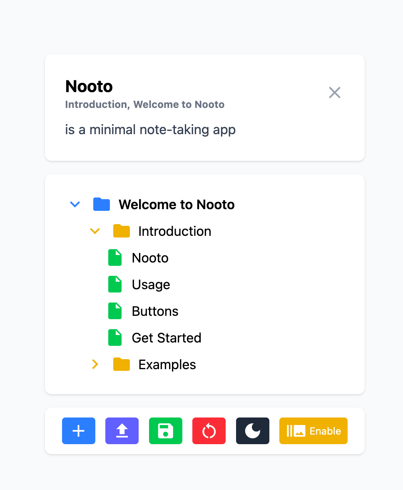

# Nooto

is a minimal note-taking app



I want to keep small notes in a fast, simple and efficent way to study Japanese. Existing solutions are overkill for me, so I wanted to make my own note taking app.

> Code is really messy and needs refactoring!

## TODO

- [ ] Refactor code
- [ ] Add cloud-save integration
- [ ] Improve Dark Mode

---
---
---

# sv

Everything you need to build a Svelte project, powered by [`sv`](https://github.com/sveltejs/cli).

## Creating a project

If you're seeing this, you've probably already done this step. Congrats!

```bash
# create a new project in the current directory
npx sv create

# create a new project in my-app
npx sv create my-app
```

## Developing

Once you've created a project and installed dependencies with `npm install` (or `pnpm install` or `yarn`), start a development server:

```bash
npm run dev

# or start the server and open the app in a new browser tab
npm run dev -- --open
```

## Building

To create a production version of your app:

```bash
npm run build
```

You can preview the production build with `npm run preview`.

> To deploy your app, you may need to install an [adapter](https://svelte.dev/docs/kit/adapters) for your target environment.
